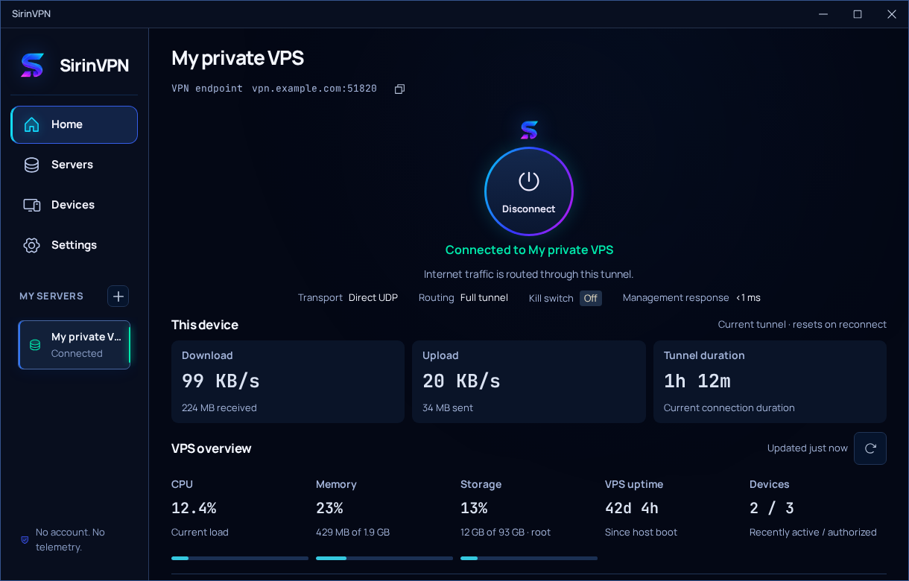
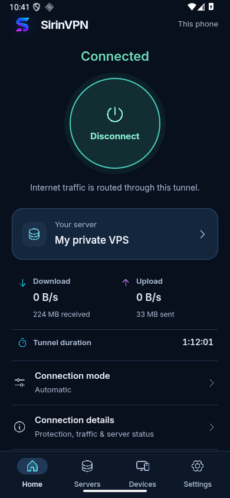

<p align="center">
  
</p>

# SirinVPN

**Your VPS. Your VPN.**

SirinVPN is a self-hosted WireGuard VPN with Linux, Windows, and Android clients.
Set up a server you control, connect your devices, and share access through signed
invitations. Server setup, connections, device administration, and recovery live
in the same app.

There is no SirinVPN account or hosted control service. The clients communicate
directly with your VPS, with no built-in analytics or traffic-history database.

**Version 0.1** · `0.1.0` in package manifests · [AGPL-3.0-only](LICENSE)

This is an early development version, published as source code. There are no
published binary releases or AUR packages yet.

[Getting started](#getting-started) · [Build from source](#build-from-source) ·
[Platform status](#platform-status) · [Documentation](#documentation)

## A look at the app



<details>
<summary>Android interface</summary>
<p>
  
</p>
</details>

Screenshots use fictional profiles and example data.

## What it does

- **Set up your own server.** Provision a Debian 13 VPS over SSH, verify its host
  fingerprint, and manage SirinVPN-owned services and firewall rules.
- **Choose a connection transport.** Direct WireGuard UDP, obfuscated UDP, TCP
  fallback, and pinned TLS/HTTPS transport, with configurable endpoints and
  bounded automatic fallback.
- **Manage people and devices.** Owner, Admin, and Member roles; signed invitations
  and QR enrollment; device revocation, access limits, and delegated permissions.
- **Control routing and DNS.** Full-tunnel or selected-subnet routing, explicit LAN
  access, platform-specific application routing, and recursive, DoT, or DoH DNS
  with private records and split zones.
- **Keep the VPN independent of the interface.** Native services own the tunnel.
  Android includes notification controls, a Quick Settings tile, and integration
  with Android's Always-on VPN and lockdown settings.
- **See current measurements.** Download/upload rates, tunnel duration, VPS
  resource use, private-tunnel quality, and MTU measurements without an activity
  timeline or stored traffic history.
- **Recover and maintain access.** Encrypted device and VPS backups, recovery
  packages, key rotation, server repair, and signed endpoint migration.

Availability and verification vary by platform. The
[desktop feature map](docs/overhaul-feature-map.md) and
[Android feature matrix](docs/android/features.md) describe the individual paths.

## Platform status

| Platform | Implementation / build path | Verification and limits |
| --- | --- | --- |
| **Linux** | Desktop, CLI, privileged helper, systemd and nftables; Debian/AppImage packaging. | Disposable kernel and exact Debian package acceptance passed. Two earlier fallback DNS observations remain unresolved; AppImage runtime and wider desktops need qualification. |
| **Android 10+** | Separate VPN process, Keystore, QR, notifications and Quick Settings; ARM64/x86_64 APK build paths. | Debug APK, API 29/36 instrumentation and Samsung S25+ lifecycle/lockdown checks passed. Other OEMs, overnight power behavior and physical 16 KB pages remain unqualified. No home-screen widget is implemented. |
| **Windows** | LocalSystem service, WireGuardNT, WFP and DPAPI; MSVC/NSIS tooling. | Native Windows 11 units, cross-user controls, four transports and crash/reboot checks passed; exact scope is in the remediation ledger. Broader release qualification remains open. Executable routing requires a signed, qualified driver. |
| **VPS** | Debian 13 x86_64/ARM64 server payloads with private management, DNS and relays. | Cross-architecture builds do not establish ARM64 native runtime acceptance. |

macOS and iOS clients are not implemented. Android parity, device-specific power
behavior, and several recovery/update workflows still need broader verification;
see the [Android verification report](docs/android/progress.md). Historical test
reports apply to their named builds, not every subsequent change.

The [26 September remediation report](docs/remediation.md) records exact current
results, local evidence paths, configured CI, and release blockers. New Linux
credentials require the system keyring. Permission-protected, unencrypted file
fallback requires explicit consent in Settings → General → Credential storage
or `sirinvpn storage allow-private-file`; existing legacy profiles remain readable.

## Getting started

You need a VPS you administer, running Debian 13, with privileged SSH access and
reachable ports for the transports you choose. SirinVPN does not provide servers
or a VPN subscription.

1. **Build the client** for your platform using the instructions below.
2. **Set up your VPS** from the app. Verify the SSH fingerprint through your VPS
   provider's console or another trusted channel before accepting it.
3. **Connect**, accepting the operating system's VPN or administrator prompt when
   needed. Run desktop clients as your ordinary user; the native service handles
   privileged networking.
4. **Add other devices** by creating an invitation on an authorized device, then
   scanning its QR code or entering the invitation in another client.

On Android, notification permission enables app notifications. Trusting Wi-Fi
requires Android's location permission and Location setting so the app can read
the network identity; it does not request GPS coordinates. Marking a network
trusted is a separate action.

## Build from source

```sh
git clone https://github.com/RamazanBerk20/SirinVPN.git
cd SirinVPN
```

The repository pins Rust in [`rust-toolchain.toml`](rust-toolchain.toml) and pnpm
in [`apps/desktop/package.json`](apps/desktop/package.json). The current development
toolchain uses Rust 1.97.1, Node.js 26, and pnpm 11.3.0.

### Linux

For Debian and AppImage artifacts, the container build supplies the native build
dependencies and builds the bundled server and helper:

```sh
./scripts/package-linux-container.sh
```

This requires Docker. Outputs are under `target/release/bundle/deb/` and
`target/release/bundle/appimage/`. Building locally does not publish a release.

For development, install the Linux native dependencies listed in
[Development](docs/development.md), then run:

```sh
pnpm --dir apps/desktop install --frozen-lockfile
CARGO_BUILD_JOBS=2 cargo build --workspace --locked
pnpm --dir apps/desktop tauri dev
```

VPN operations also need the native helper and system integration; a frontend
development server alone does not install them.

### Android

Android builds require JDK 17, Android SDK 36, NDK `30.0.16248370`, Go 1.27.1,
the Android Rust targets, and both bundled VPS server payloads. Follow the
[Android build guide](docs/android/build-and-test.md) to prepare those inputs.
With them in place:

```sh
pnpm --dir apps/desktop install --frozen-lockfile
export GO_BIN="$(command -v go)"
sh scripts/build-android.sh all debug
```

The APK is written to
`apps/desktop/src-tauri/gen/android/app/build/outputs/apk/universal/debug/app-universal-debug.apk`.
This is a development build. Generated Android files live under
`apps/desktop/src-tauri/gen/`; edit the tracked sources in
`apps/desktop/android/` instead.

### Windows

Use [`scripts/package-windows.ps1`](scripts/package-windows.ps1) on Windows with
the MSVC toolchain, Visual C++ tools, Perl, Node.js, pnpm, the two Linux VPS
payloads, and a matching routing driver. Required arguments and platform limits
are documented in [Windows integration](docs/windows-integration-2026-09-07.md).
Cross-compilation alone does not establish Windows runtime support.

## Development and tests

Fast frontend checks:

```sh
pnpm --dir apps/desktop test
pnpm --dir apps/desktop build
```

The full local gate includes source-size checks, Python tests, Rust formatting,
Clippy, workspace tests, frontend checks, and privacy invariants:

```sh
./scripts/test.sh
```

Some native tests require isolated VMs or emulators and are intentionally not run
by a normal workspace test. See [Testing](docs/testing.md) and the
[Android test guide](docs/android/build-and-test.md). Administrative and destructive
acceptance tests belong on disposable infrastructure, never a personal VPS.

## How it is organized

| Path | Responsibility |
| --- | --- |
| `apps/desktop/src/` | Shared React interface with desktop and Android layouts |
| `apps/desktop/src-tauri/` | Tauri host and native command adapters |
| `apps/desktop/android/` | Android services, permissions, notifications, QR scanning, and WireGuard bridge |
| `crates/core/`, `crates/protocol/` | Profiles, identities, invitations, management, and shared contracts |
| `crates/server/`, `crates/installer/` | VPS services and SSH provisioning/maintenance |
| `crates/transport/` | Direct and authenticated fallback carriers |
| `crates/linux-helper/`, `crates/windows-service/`, `crates/android-runtime/` | Platform-owned VPN lifecycles |
| `tests/`, `scripts/`, `packaging/` | Validation, build tooling, and system integration |

## Privacy and security

Each device generates its own permanent identity. SSH setup verifies the server's
host key; management traffic uses a private tunnel endpoint with certificate
pinning and mutual TLS. Credentials stay in native storage, with platform-specific
protection. See [Security](SECURITY.md) and [Privacy](PRIVACY.md) for the boundaries.

A VPN does not remove trust in your device, VPS operator, hosting provider, or
chosen DNS resolver. Alternative transports cannot guarantee connectivity when
the server address or required ports are blocked. No independent security audit
is claimed for version 0.1.

For ordinary bugs, [open an issue](https://github.com/RamazanBerk20/SirinVPN/issues)
with your platform, build, and reproduction steps. Do not attach real invitation
codes, keys, passwords, backups, or private VPS details.

## Documentation

- [Development](docs/development.md) and [architecture](docs/architecture.md)
- [Testing](docs/testing.md) and [source map](docs/module-map.md)
- [Android build, design, and verification](docs/android/README.md)
- [Desktop feature map](docs/overhaul-feature-map.md)
- [Windows integration](docs/windows-integration-2026-09-07.md)
- [Signed update design](docs/releases.md) — implementation documentation; no published releases yet

## License

SirinVPN is licensed under the **GNU Affero General Public License v3.0 only**.
See [LICENSE](LICENSE). Third-party components retain their own licenses;
platform-specific notices are included with the corresponding build tooling.
